# 购物车文档

## 一、情景再现	

​	现在的社会购物都会去商城购买商品，用户在进入商城点击商品加入购物车，当选好自己的商品，进入购物里，购物车里可能会有多个商品，购物车功能：选择添加或减少商品的数量，删除购物车里的商品，选择单个商品或取消单个商品，全选购物车里的商品或取消全选商品，没有登录的用户也可以添加商品到购物车，并同步登录后的购物车。


## 二、事件定义

#### 1. 通过POST方式，用户登录后将添加购物车的商品数据存到redis中。

##### 	1.1 点击某个商品，将商品添加到购物车

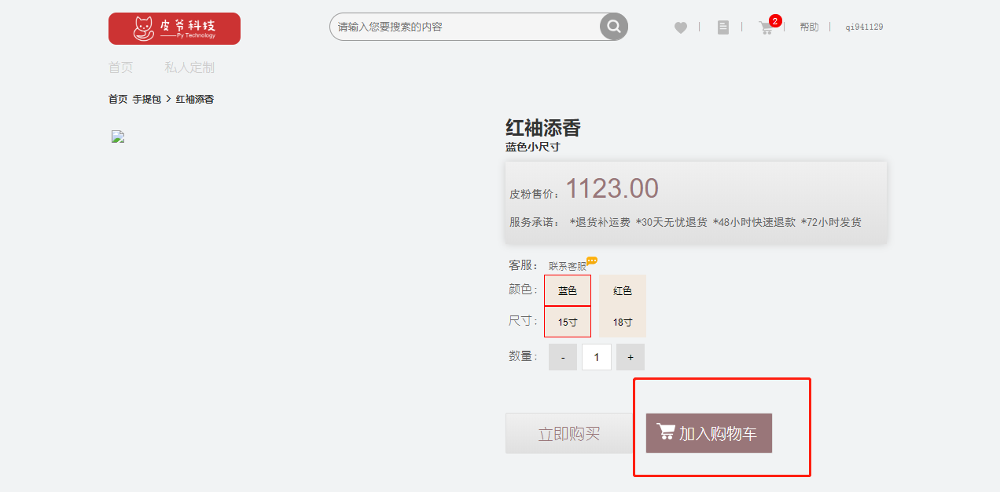

#### 	

#### 2. 通过GET方式，访问购物车页面，并将redis中的所有数据响应给前端页面显示。

##### 	2.1 进入dadashop首页点击购物车小图片

​	

##### 	2.2 购物车显示内容

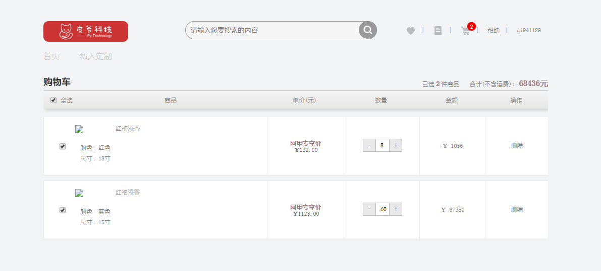


#### 3. 通过DELETE方式，发送请求，删除购物车中商品。

##### 	3.1 进入购物车后点击商品右侧的删除键删除该商品

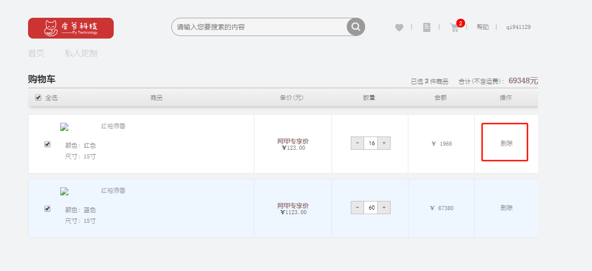

##### 	3.2 删除流程

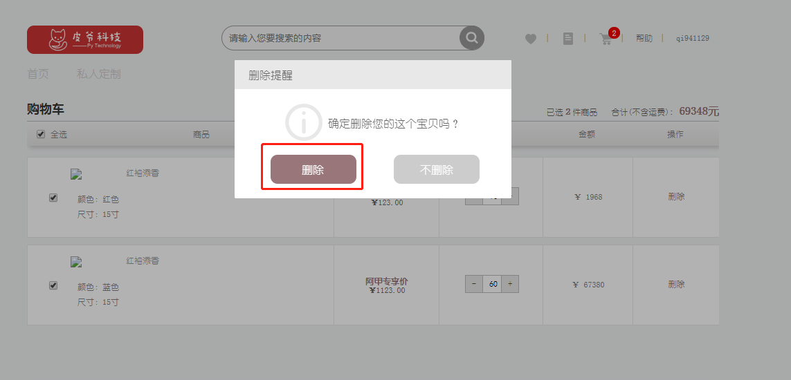

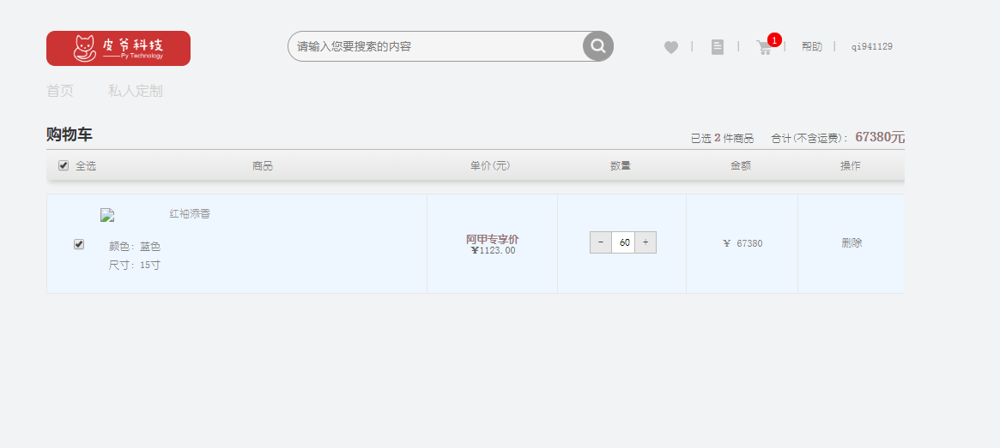


#### 4. 通过PUT方式，在购物车页面添加减少商品数量，发送sate状态，判断事件状态。

##### 	4.1 进入购物车后点击商品数量的减号 “-”

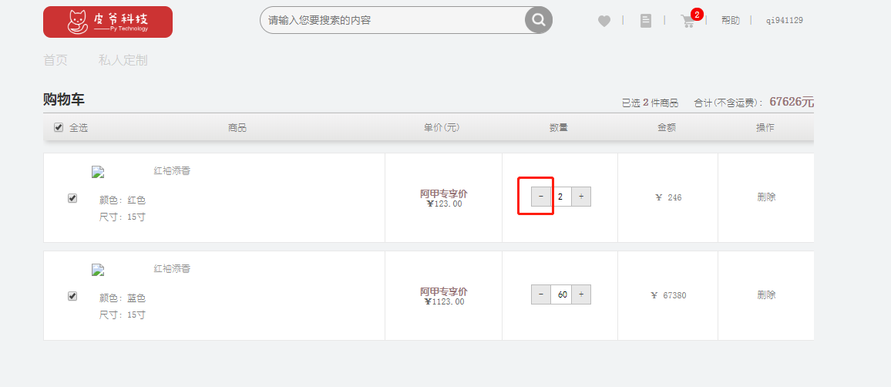

##### 	4.2 进入购物车后点击商品数量的加号 “+”

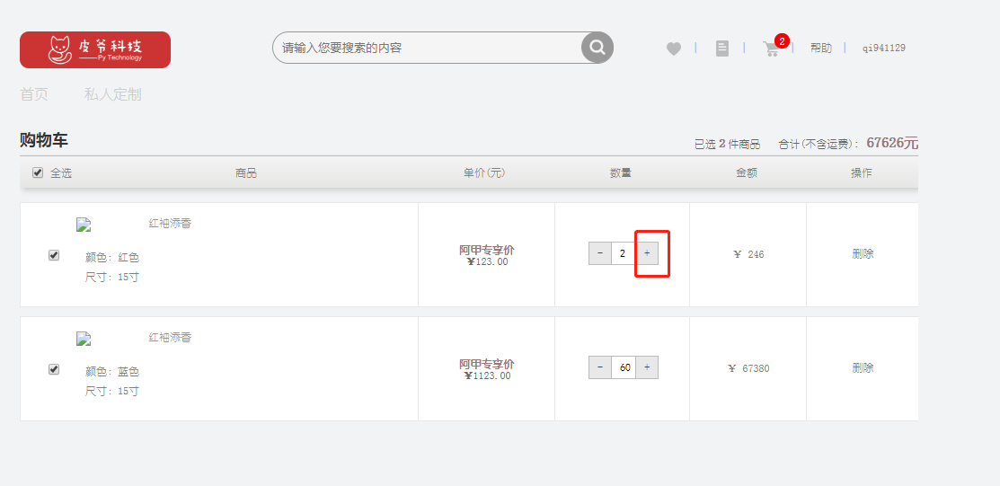

#### 	

#### 5. 通过PUT方式，在购物车页面勾选单个商品或取消勾选单个商品，发送sate状态，判断事件状态。

##### 	5.1 默认商品是勾选中的，取消勾选单个商品

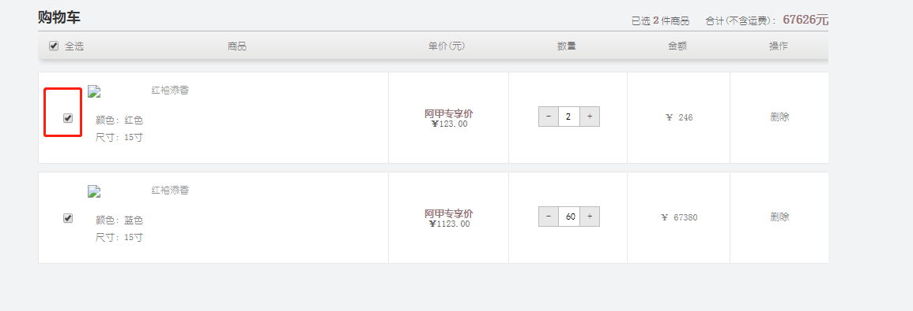

##### 	5.2 勾选单个商品

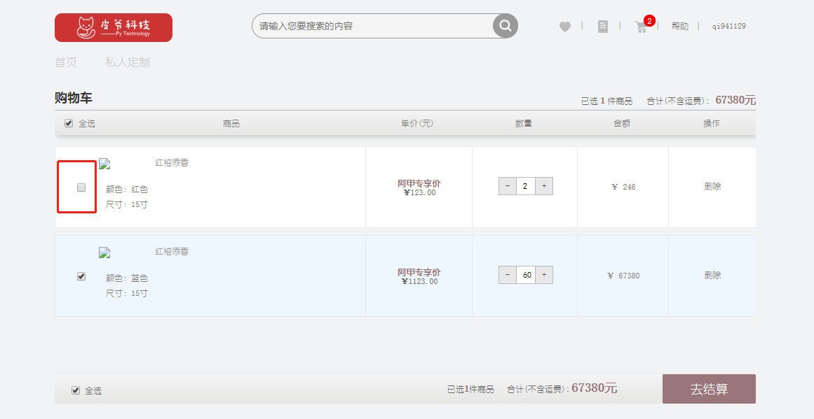

#### 	

#### 6. 通过PUT方式，在购物车页面全选商品或取消全选商品，发送sate状态，判断事件状态。

##### 	6.1 默认是全选商品，取消全选商品，点击全选商品

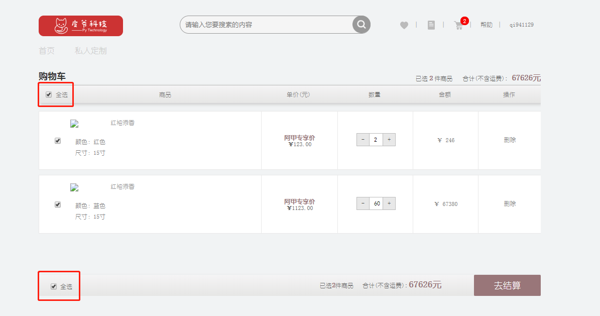

##### 	6.2 全选商品，点击全选商品

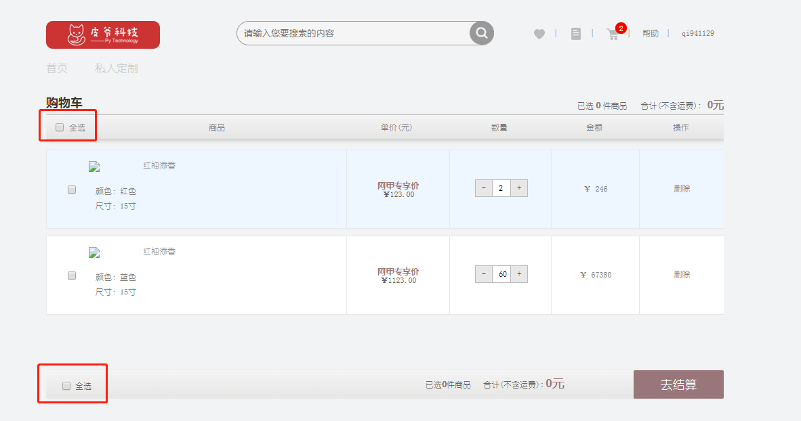


## 三、API接口说明

#### 1.添加购物车

URL： 127.0.0.1:8000/v1/carts/<username> 

请求方式：POST

请求参数：JSON

|  参数  | 类型 | 是否必须 |    说明    |
| :----: | :--: | :------: | :--------: |
| sku_id | int  |    是    | 商品sku_id |
| count  | int  |    是    |    数量    |

```
请求士例：
{ "sku_id":2,"count":"1"}
```

返回值：JSON

响应格式：

```
响应士例：
{"code":200,"data":skus_list}
```

| 字段  |   含义   | 类型 | 备注                        |
| :---: | :------: | :--: | --------------------------- |
| code  |  状态码  | int  | 默认正常为200，异常见状态码 |
| data  | 具体数据 | dict | 与error二选一               |
| error | 错误信息 | char | 与data二选一                |

skus_list参数信息

| 参数               | 类型    | 是否必须 | 说明                            |
| ------------------ | ------- | -------- | ------------------------------- |
| id                 | int     | 是       | 商品sku_id                      |
| name               | str     | 是       | 商品名称                        |
| count              | int     | 是       | 商品数量                        |
| default_image_url  | str     | 是       | 商品默认图片路径                |
| price              | decimal | 是       | 商品单价                        |
| sku_sale_attr_name | list    | 是       | 商品属性                        |
| sku_sale_attr_val  | list    | 是       | 商品属性值                      |
| selected           | int     | 是       | 商品的选中状态（0未选中,1选中） |

```python
#sku_list中数据示例 [{"id":"","name":"","count":"","selected":"","default_image_url":"","price":"","sku_sale_attr_na me":[],"sku_sale_attr_val":[]},{"":""...}]
```

状态码参数：

| 状态码 | 响应信息         | 原因短句                    |
| ------ | ---------------- | --------------------------- |
| 200    | 正常             | OK                          |
| 30101  | 未找到商品       | SKU query error             |
| 30102  | 传参部证券       | Incorrect pass of reference |
| 30103  | 购买数量超过库存 | exceeds the inventory       |
| 30104  | 未找到用户       | User query error            |


#### 2.查询购物车

URL： 127.0.0.1:8000/v1/carts/<username>

请求方式: GET

请求参数：无

返回值：JSON

响应格式：

```
#响应示例： 
{"code":200,"data":skus_list}
```

| 字段  | 含义     | 类型 | 备注                        |
| ----- | -------- | ---- | --------------------------- |
| code  | 状态码   | int  | 默认正常为200，异常见状态码 |
| data  | 具体数据 | dict | 与error二选一               |
| error | 错误信息 | char | 与data二选一                |

sku_list参数信息

| 参数               | 类型    | 是否必须 | 说明                             |
| ------------------ | ------- | -------- | -------------------------------- |
| id                 | int     | 是       | 商品sku_id                       |
| name               | str     | 是       | 商品名称                         |
| count              | int     | 是       | 商品数量                         |
| default_image_url  | str     | 是       | 商品默认图片路径                 |
| price              | decimal | 是       | 商品单价                         |
| sku_sale_attr_name | list    | 是       | 商品属性                         |
| sku_sale_attr_val  | list    | 是       | 商品属性值                       |
| selected           | int     | 是       | 商品的选中状态（0未选中，1选中） |

```python
#sku_list中数据示例 [{"id":"","name":"","count":"","selected":"","default_image_url":"","price":"","sku_sale_attr_na me":[],"sku_sale_attr_val":[]},{"":""...}]
```

状态码参数

| 状态码 | 响应信息   | 原因短语         |
| ------ | ---------- | ---------------- |
| 200    | 正常       | OK               |
| 30104  | 未找到用户 | User query error |


#### 3.删除购物车数据

URL： 127.0.0.1:8000/v1/carts/<username> 

请求方式：DELETE

请求参数

```python
#请求参数示例： 
{"sku_id":1001}
```

| 参数   | 类型 | 是否必须 | 说明       |
| ------ | ---- | -------- | ---------- |
| sku_id | int  | 是       | 商品sku_id |

返回值：json

响应格式：

```python
#响应示例 
{"code":200,"data":skus_list}
```

| 字段  | 含义     | 类型 | 备注                            |
| ----- | -------- | ---- | ------------------------------- |
| code  | 状态码   | int  | 默认正常为200，异常见状态码参考 |
| data  | 具体数据 | dict | 与error二选一                   |
| error | 错误信息 | char | 与data二选一                    |

skus_list参数信息

| 参数               | 类型    | 是否必须 | 说明                             |
| ------------------ | ------- | -------- | -------------------------------- |
| id                 | int     | 是       | 商品sku_id                       |
| name               | str     | 是       | 商品名称                         |
| count              | int     | 是       | 商品数量                         |
| default_image_url  | str     | 是       | 商品默认图片路径                 |
| price              | decimal | 是       | 商品单价                         |
| sku_sale_attr_name | list    | 是       | 商品属性                         |
| sku_sale_attr_val  | list    | 是       | 商品属性值                       |
| selected           | int     | 是       | 商品的选中状态（0未选中，1选中） |

```python
#sku_list中数据示例 [{"id":"","name":"","count":"","selected":"","default_image_url":"","price":"","sku_sale_attr_na me":[],"sku_sale_attr_val":[]},{"":""...}]
```

状态码参考

| 状态码 | 响应信息   | 原因短句         |
| ------ | ---------- | ---------------- |
| 200    | 正常       | OK               |
| 30101  | 未找到商品 | SKU query error  |
| 30104  | 未找到用户 | User query error |


#### 4.购物车页面商品增加

URL： 127.0.0.1:8000/v1/carts/<username> 

请求方式：PUT

请求参数：JSON

| 参数   | 类型 | 是否必须 | 说明           |
| ------ | ---- | -------- | -------------- |
| sku_id | int  | 是       | 商品sku_id     |
| count  | int  | 是       | 前端显示的数量 |
| state  | str  | 是       | 判断事件状态   |

```python
#请求示例 
{'sku_id':1001,count:1,state:'add'}
```

返回值：JSON

响应格式：

```
#响应示例： 
{"code":200,"data":skus_list}
```

| 参数               | 类型    | 是否必须 | 说明                             |
| ------------------ | ------- | -------- | -------------------------------- |
| id                 | int     | 是       | 商品sku_id                       |
| name               | str     | 是       | 商品名称                         |
| count              | int     | 是       | 商品数量                         |
| default_image_url  | str     | 是       | 商品默认图片路径                 |
| price              | decimal | 是       | 商品单价                         |
| sku_sale_attr_name | list    | 是       | 商品属性                         |
| sku_sale_attr_val  | list    | 是       | 商品属性值                       |
| selected           | int     | 是       | 商品的选中状态（0未选中，1选中） |

```python
#sku_list中数据示例 [{"id":"","name":"","count":"","selected":"","default_image_url":"","price":"","sku_sale_attr_na me":[],"sku_sale_attr_val":[]},{"":""...}]
```

状态码参考

| 状态码 | 响应信息   | 原因短语         |
| ------ | ---------- | ---------------- |
| 200    | 正常       | OK               |
| 30101  | 未找到商品 | SKU query error  |
| 30104  | 未找到用户 | User query error |


#### 5.购物车页面商品减少

URL： 127.0.0.1:8000/v1/carts/<username> 

请求方式: PUT

请求参数：JSON

| 参数   | 类型 | 是否必须 | 说明         |
| ------ | ---- | -------- | ------------ |
| sku_id | int  | 是       | 商品的sku_id |
| count  | int  | 是       | 前端显示数量 |
| state  | str  | 是       | 判断事件状态 |

```python
#请求示例： 
{'sku_id':1001,count:1,state:'del'}
```

返回值：JSON

响应格式：

```
#响应示例： 
{"code":200,"data":skus_list}
```

| 字段  | 含义     | 类型 | 备注                        |
| ----- | -------- | ---- | --------------------------- |
| code  | 状态码   | int  | 默认正常为200，异常见状态码 |
| data  | 具体数据 | dict | 与error二选一               |
| error | 错误信息 | char | 与data二选一                |

skus_list参数信息

| 参数               | 类型    | 是否必须 | 说明                             |
| ------------------ | ------- | -------- | -------------------------------- |
| id                 | int     | 是       | 商品sku_id                       |
| name               | str     | 是       | 商品名称                         |
| count              | int     | 是       | 商品数量                         |
| default_image_url  | str     | 是       | 商品默认图片路径                 |
| price              | decimal | 是       | 商品单价                         |
| sku_sale_attr_name | list    | 是       | 商品属性                         |
| sku_sale_attr_val  | list    | 是       | 商品属性值                       |
| selected           | int     | 是       | 商品的选中类型（0未选中，1选中） |

```python
#sku_list中数据示例 [{"id":"","name":"","count":"","selected":"","default_image_url":"","price":"","sku_sale_attr_na me":[],"sku_sale_attr_val":[]},{"":""...}]
```

状态码参数


| 状态码 | 响应信息   | 原因短语         |
| ------ | ---------- | ---------------- |
| 200    | 正常       | OK               |
| 30101  | 未找到商品 | SKU query error  |
| 30104  | 未找到用户 | User query error |


#### 6.购物车商品选择勾选

URL： 127.0.0.1:8000/v1/carts/<username>

请求方式: PUT

请求参数：JSON

| 参数   | 类型 | 是否必须 | 说明                   |
| ------ | ---- | -------- | ---------------------- |
| sku_id | int  | 是       | 购物车显示商品的sku_id |
| state  | str  | 是       | 判断事件状态           |

```
#请求示例 
{'sku_id':1001,state:'select'}
```

返回值：JSON

响应格式

```python
#响应示例： 
{"code":200,"data":skus_list}
```

| 字段  | 含义     | 类型 | 备注                            |
| ----- | -------- | ---- | ------------------------------- |
| code  | 状态码   | int  | 默认正常为200，异常见状态码参考 |
| data  | 具体数据 | dict | 与error二选一                   |
| error | 错误信息 | char | 与data二选一                    |

skus_list参数信息

| 参数               | 类型    | 是否必须 | 说明                             |
| ------------------ | ------- | -------- | -------------------------------- |
| id                 | int     | 是       | 商品sku_id                       |
| name               | str     | 是       | 商品名称                         |
| count              | int     | 是       | 商品数量                         |
| default_image_url  | str     | 是       | 商品默认图片路径                 |
| price              | decimal | 是       | 商品单价                         |
| sku_sale_attr_name | list    | 是       | 商品属性                         |
| sku_sale_attr_val  | list    | 是       | 商品属性值                       |
| selected           | int     | 是       | 商品的选中状态（0未选中，1选中） |

```python
#sku_list中数据示例 [{"id":"","name":"","count":"","selected":"","default_image_url":"","price":"","sku_sale_attr_na me":[],"sku_sale_attr_val":[]},{"":""...}]
```

状态码参考

| 状态码 | 响应信息   | 原因短语         |
| ------ | ---------- | ---------------- |
| 200    | 正常       | OK               |
| 30101  | 未找到商品 | SKU query error  |
| 30104  | 未找到用户 | User query error |


#### 7.购物车商品取消勾选

URL： 127.0.0.1:8000/v1/carts/<username>

请求方式: PUT

请求参数：JSON

| 参数   | 类型 | 是否必须 | 说明                   |
| ------ | ---- | -------- | ---------------------- |
| state  | str  | 是       | 判断事件状态           |
| sku_id | int  | 是       | 购物车显示商品的sku_id |

```python
#请求示例 
{'sku_id':1001,state:'unselect'}
```

返回值:JSON

响应格式:

```python
#响应示例： 
{"code":200,"data":skus_list}
```

| 字段  | 含义     | 类型 | 备注                            |
| ----- | -------- | ---- | ------------------------------- |
| code  | 状态码   | int  | 默认正确为200，异常见状态码参考 |
| data  | 具体数据 | dict | 与error二选一                   |
| error | 错误细腻 | char | 与data二选一                    |

skus_list参数信息

| 参数               | 类型    | 是否必须 | 说明                             |
| ------------------ | ------- | -------- | -------------------------------- |
| id                 | int     | 是       | 商品sku_id                       |
| name               | str     | 是       | 商品名称                         |
| count              | int     | 是       | 商品数量                         |
| default_image_url  | str     | 是       | 商品默认图片路径                 |
| price              | decimal | 是       | 商品单价                         |
| sku_sale_attr_name | list    | 是       | 商品属性                         |
| sku_sale_attr_val  | list    | 是       | 商品属性值                       |
| selected           | int     | 是       | 商品的选中状态（0未选中，1选中） |

```python
#sku_list中数据示例 [{"id":"","name":"","count":"","selected":"","default_image_url":"","price":"","sku_sale_attr_na me":[],"sku_sale_attr_val":[]},{"":""...}]
```

状态码参考

| 状态码 | 响应信息   | 原因短语         |
| ------ | ---------- | ---------------- |
| 200    | 正常       | OK               |
| 30101  | 未找到商品 | SKU query error  |
| 30104  | 未找到用户 | User query error |


#### 8.购物车商品全选

URL： 127.0.0.1:8000/v1/carts/<username>

请求方式: PUT

请求参数：JSON

| 参数  | 类型 | 是否必须 | 说明         |
| ----- | ---- | -------- | ------------ |
| state | str  | 是       | 判断事件状态 |

```
#请求示例： 
{state:'selectall'}
```

返回值：JSON

响应格式

```python
#响应示例： 
{"code":200,"data":skus_list}
```

| 参数               | 类型    | 是否必须 | 说明                             |
| ------------------ | ------- | -------- | -------------------------------- |
| id                 | int     | 是       | 商品sku_id                       |
| name               | str     | 是       | 商品名称                         |
| count              | int     | 是       | 商品数量                         |
| default_image_url  | str     | 是       | 商品默认图片路径                 |
| price              | decimal | 是       | 商品单价                         |
| sku_sale_attr_name | list    | 是       | 商品属性                         |
| sku_sale_attr_val  | list    | 是       | 商品属性值                       |
| selected           | int     | 是       | 商品的选中状态（0未选中，1选中） |

```python
#sku_list中数据示例 [{"id":"","name":"","count":"","selected":"","default_image_url":"","price":"","sku_sale_attr_na me":[],"sku_sale_attr_val":[]},{"":""...}]
```

状态码参考

| 状态码 | 响应信息   | 原因短句         |
| ------ | ---------- | ---------------- |
| 200    | 正常       | OK               |
| 30104  | 未找到用户 | User query error |


#### 9 购物车商品全不选

URL： 127.0.0.1:8000/v1/carts/<username>

请求方式: PUT

请求参数：JSON

| 参数  | 类型 | 是否必须 | 说明         |
| ----- | ---- | -------- | ------------ |
| state | str  | 是       | 判断事件状态 |

```
#请求示例 
{state:'unselectall'}
```

返回值：JSON

响应格式：

```python
#响应示例： 
{"code":200,"data":skus_list}
```

| 字段 | 含义     | 类型 | 备注                            |
| ---- | -------- | ---- | ------------------------------- |
| code | 状态码   | int  | 默认正常为200，异常见状态码参考 |
| data | 具体数据 | dict | 与error二选一                   |
| erro | 错误信息 | char | 与data二选一                    |

skus_list参数信息

| 参数               | 类型    | 是否必须 | 说明                            |
| ------------------ | ------- | -------- | ------------------------------- |
| id                 | int     | 是       | 商品sku_id                      |
| name               | str     | 是       | 商品名称                        |
| count              | int     | 是       | 商品数量                        |
| default_image_url  | str     | 是       | 商品默认图片路径                |
| price              | decimal | 是       | 商品单价                        |
| sku_sale_attr_name | list    | 是       | 商品属性                        |
| sku_sale_attr_val  | list    | 是       | 商品属性值                      |
| selected           | int     | 是       | 商品的选中状态（0未选中,1选中） |

```python
#sku_list中数据示例 [{"id":"","name":"","count":"","selected":"","default_image_url":"","price":"","sku_sale_attr_na me":[],"sku_sale_attr_val":[]},{"":""...}]
```

状态码参考

| 状态码 | 响应信息   | 愿意短语         |
| ------ | ---------- | ---------------- |
| 200    | 正常       | OK               |
| 30104  | 未找到用户 | User query error |

