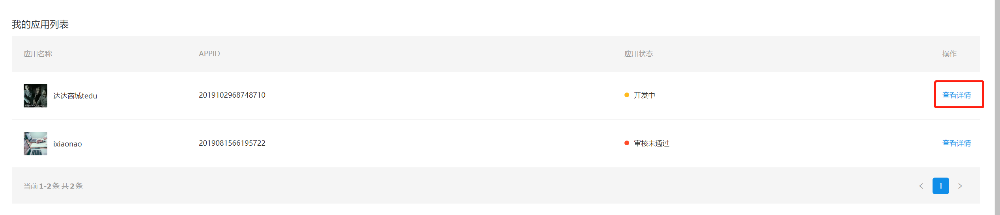
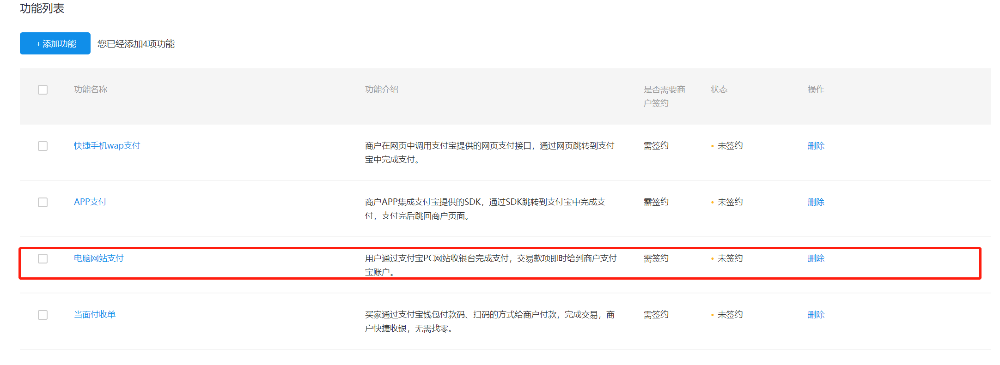
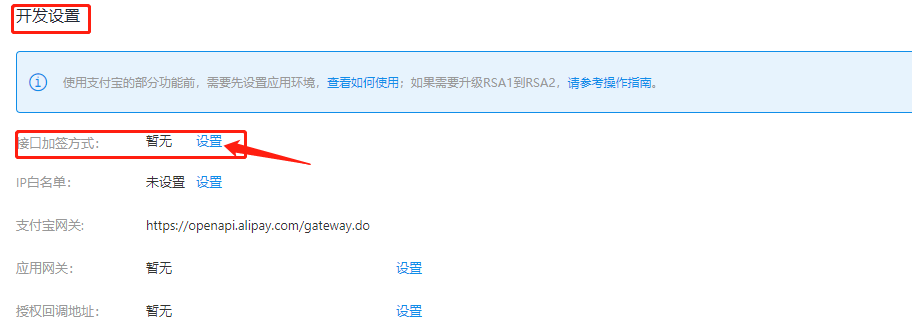
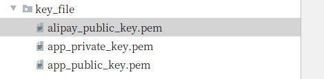

# 第三方支付-支付宝接入相关

### 1.使用openssl库生成一对秘钥（公钥和私钥）备用

- 1.1 安装python-alipay-sdk

​	`tarena@tedu:~$pip install python-alipay-sdk --upgrade`

- 1.2 生成秘钥文件app_private_key.pem  和 app_public_key.pem

```python
tarena@tedu:~$openssl
OpenSSL> genrsa -out app_private_key.pem   2048  # 私钥
OpenSSL> rsa -in app_private_key.pem -pubout -out app_public_key.pem # 导出公钥
OpenSSL> exit
tarena@tedu:~$ls
    app_private_key.pem   app_public_key.pem

```

### 2.支付宝创建应用

- 2.1 点击链接，进入支付宝开放平台(https://openhome.alipay.com/platform/home.htm)

- 2.2 使用支付宝账号登录（扫码或者账号密码登录)

  

- 2.3 点击“开发者中心”，选择“网页移动应用”

  

- 2.4 选择“支付接入”功能，创建一个应用.

  

- 2.5 应用设置, 填写必填项，应用类型选择“网页应用”，点击”确认创建”。

  

### 3.给应用添加功能

- 3.1 点击应用的”查看详情“

  

- 3.2 在功能列表中添加”电脑网站支付”功能(默认没有)

  ###### 

  

### 4. 给“电脑网站支付“功能接口加签

- 4.1添加“电脑网站支付功能”后，进行开发设置，选择“接口加签方式”，点击“设置”

  

  将1.2中公钥app_public_key.pem的内容复制进去，

  保存设置，生成支付宝公钥，并保存在文件aplipay_public_key.pem中。

  

- 4.2 同意《支付宝业务协作协议》后点击“提交审核”

  

  

  #### 说明:

  以上步骤为商家接入支付宝需要在开发平台做的操作,填写信息后提交审核通过后方可进行线上交易。
  开发测试阶段可以使用沙箱环境进行开发
  后续转为线上模式时只需要修改APPID即可代码不用动。

### 5.沙箱环境开发(https://docs.open.alipay.com/200/105311#s0):

- 5.1 登录到沙箱环境

  

- 5.2 关于沙箱：由支付宝官方虚拟的商家账户，开发者可以用来进行测试.需要先给沙箱配置公钥。需要记录 APPID和支付宝网关.

  

  将应用公钥添加完毕后就可以看到支付宝公钥,将支付宝公钥复制出来放到项目文件夹中

  

### 6.后端代码实现(DJango):

- 6.1 公钥文件:需要将私钥和支付宝公钥 放到项目目录中.

  - 1.支付宝公钥
  - 2.应用私钥
  - 3.应用公钥

  

- 6.2 AliPay工具包:支付宝官方sdk没有针对Python的封装，使用起来比较麻烦我们这里使用github码友封装的工具包安装详见(https://github.com/fzlee/alipay/blob/master/README.zh-hans.md)

  `支付时序图`

  

  `alipay相关`

  - 安装

    ```
    # 安装python-alipay-sdk
    pip install python-alipay-sdk --upgrade
    ```

  - 接口说明:

    **1.Alipay()**

    参数

    ```
    # 应用id
    appid="",
    # 默认回调url
    app_notify_url=None,  
    # 应用私钥
    app_private_key_string="",
    # 支付宝的公钥
    alipay_public_key_string="",
    # 签名方式 RSA或RSA2
    sign_type="RSA",
    # 运行环境
    debug=False  
    ```

    返回值

    一个**支付对象**

    作用:

    返回一个**支付对象**用作调用alipayAPI.

    **2.支付对象.api_alipay_trade_page_pay（）**

    参数

    ```
    # 订单编号
    out_trade_no="",
    # 订单总金额
    total_amount=0.01,
    # 订单标题
    subject=subject,
    # 重定向URL
    return_url="https://example.com",
    # 回调URL，可选！不填则使用默认的notify_url
    notify_url="https://example.com/notify" 
    ```

    返回值:

    订单信息字符串.

    作用:

    与支付宝URL进行拼接,生成新的URL做跳转支付宝业务用.

    **3.支付对象.verify()**

    参数:

    ```
    # 支付宝回调或重定向带回的参数
    result_dict
    # 支付宝回调或重定向带回的签名
    sgin
    ```

    返回值:

    布尔类型 True 或 False

    作用:

    支付宝官方提供的验签.

    **4.支付对象.api_alipay_trade_query(out_trade_no=order_id)**

    参数:

    ```
    # 订单编号
    out_trade_no
    ```

    返回值:

    订单支付的状态

    作用:

    主动查询支付结果

  `实现代码`

  ````python
  # 本demo未配置数据库故订单id等使用常量表示
  ORDER_ID = "2019111821315601" # 订单编号
  TOTAL_AMOUNT = 159            # 订单金额
  IP_URL = "127.0.0.1"          # 商户ip地址
  ORDER_STATUS = 0              # 订单状态
  
  # 处理跳转支付宝业务
  class OrderProcessingnView(View):
      # 获取跳转支付页面
      def get(self,request):
          return render(request,'ajax_alipay.html')
      # 确认支付获取支付宝支付URL
      def post(self,reuqest):
          alipay = AliPay(
              appid="2016100200644279",
              app_notify_url=None,  # 默认回调url-　阿里与商户后台交互
              # 使用的文件读取方式,载入支付秘钥
              app_private_key_path=os.path.join(os.getcwd(), "utils/key_file/s7_private_key.pem"),
              # 支付宝的公钥，验证支付宝回传消息使用，不是你自己的公钥,
              # 使用文件读取的方式,载入支付报公钥
              alipay_public_key_path=os.path.join(os.getcwd(), "utils/key_file/alipay_public_key.pem"),
              sign_type="RSA2",  # RSA 或者 RSA2
              debug=True  # 默认False
          )
          # 电脑网站支付，需要跳转到https://openapi.alipaydev.com/gateway.do? + order_string
          # 测试方式此为支付宝沙箱环境
          order_string = alipay.api_alipay_trade_page_pay(
              out_trade_no=ORDER_ID,
              total_amount=TOTAL_AMOUNT,
              subject=ORDER_ID,
              # 回转url,　支付宝与买家业务处理完毕(支付成功)将玩家重定向到此路由,带着交易的参数返回
              return_url="http://" + IP_URL + ":8000/payment/result/",
              notify_url="http://" + IP_URL + ":8000/payment/result/"  # 可选, 不填则使用默认notify url
          )
          pay_url = "https://openapi.alipaydev.com/gateway.do?" + order_string
          return http.JsonResponse({"status":1,"pay_url":pay_url})
  # 处理支付宝回调及重定向业务
  class PaymentResultView(View):
      # 获取参数字典和验签结果
      def get_sdict_ali_verify(self, request, method):
          """
          :param request:
          :param method: 请求方式
          :return: success_dict,ali_verufy,alipay
          """
          success_dict = {}
          if method == 1:
              for key, val in request.GET.items():
                  success_dict[key] = val
          if method == 2:
              for key, val in request.POST.items():
                  success_dict[key] = val
          # 1.剔除掉sign做验签准备
          sign = success_dict.pop("sign", None)
          # 2.生成alipay对象
          alipay = AliPay(
              appid="2016100200644279",
              app_notify_url="http://" + IP_URL + ":8000/v1/orders/success/",
              app_private_key_path=os.path.join(os.getcwd(), "utils/key_file/s7_private_key.pem"),
              alipay_public_key_path=os.path.join(os.getcwd(), "utils/key_file/alipay_public_key.pem"),
              debug=True
          )
          # 3.使用支付宝接口进行验签
          ali_verify = alipay.verify(success_dict, sign)
          return success_dict, ali_verify, alipay
  
      # 重定向接口
      def get(self, request):
          # 1.获取参数字典,验签结果,alipay对象
          success_dict, ali_verify, alipay = self.get_sdict_ali_verify(request, 1)
          # 2.根据验证结果进行业务处理
          if ali_verify is True:
              order_id = success_dict.get('out_trade_no', None)
              if ORDER_STATUS == 2:
                  return HttpResponse("订单支付成功")
              # 主动查询
              else:
                  result = alipay.api_alipay_trade_query(out_trade_no=order_id) #  主动查询接口
                  if result.get("trade_status", "") == "TRADE_SUCCESS":
                      return HttpResponse("主动查询结果订单支付完成了")
                  else:
                      return HttpResponse("支付未完成")
          else:
              return HttpResponse("非法访问")
  
      # 回调接口
      def post(self, request):
          """
          处理支付宝的付款回调业务
          :param request:
          :return:
          """
          # 1.获取参数字典,验签结果,alipay对象
          success_dict, ali_verify, alipay = self.get_sdict_ali_verify(request, 2)
          # 2.根据验证结果进行业务处理
          if ali_verify is True:
              trade_status = success_dict.get('trade_status', None)
              if trade_status == "TRADE_SUCCESS":
                  ORDER_STATUS = 2
                  return HttpResponse("seccess")
          else:
              return HttpResponse("非法访问")
  ````

- 6.3 关于return_url和notify_url的问题
  
  - return_url
    - 如果不给return_url支付宝处理完业务会留在自己的网页不做跳转
    - 重定向时会带上订单编号等参数
  - notify_url:
    - 支付结果异步通知
    - 对于 PC 网站支付的交易，在用户支付完成之后，支付宝会根据 API 中商户传入的 notify_url，通过 POST 请求的形式将支付结果作为参数通知到商户系统。
    - 详见(https://docs.open.alipay.com/270/105902/)
  
  